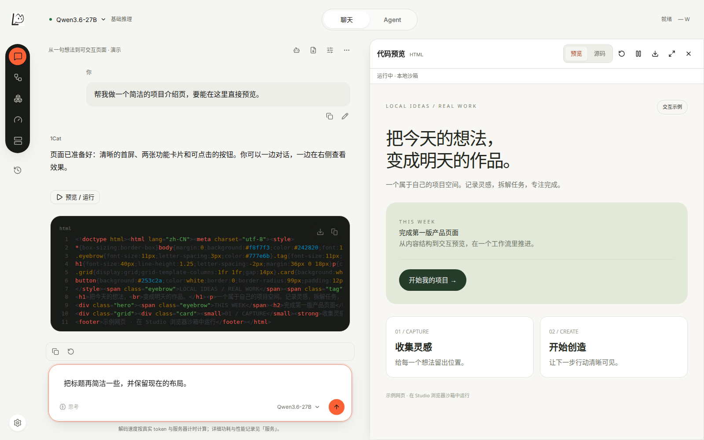
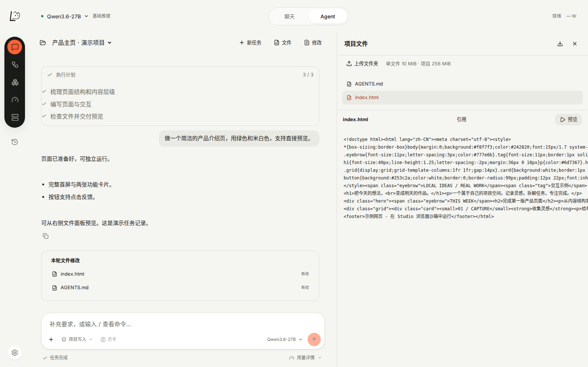
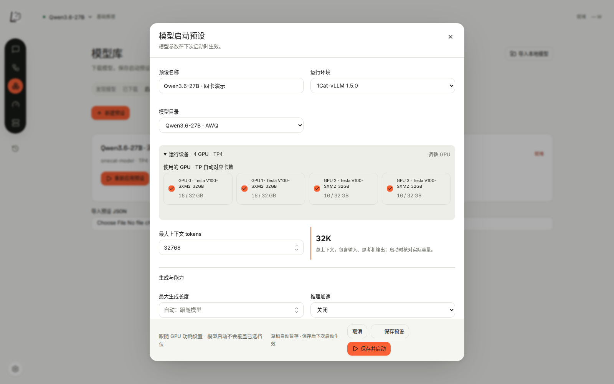
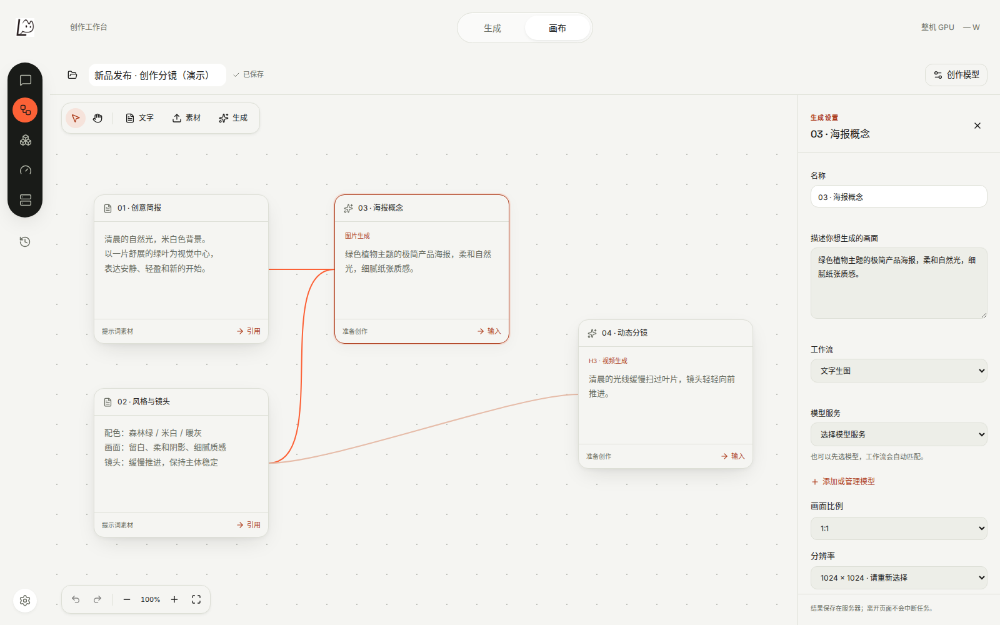
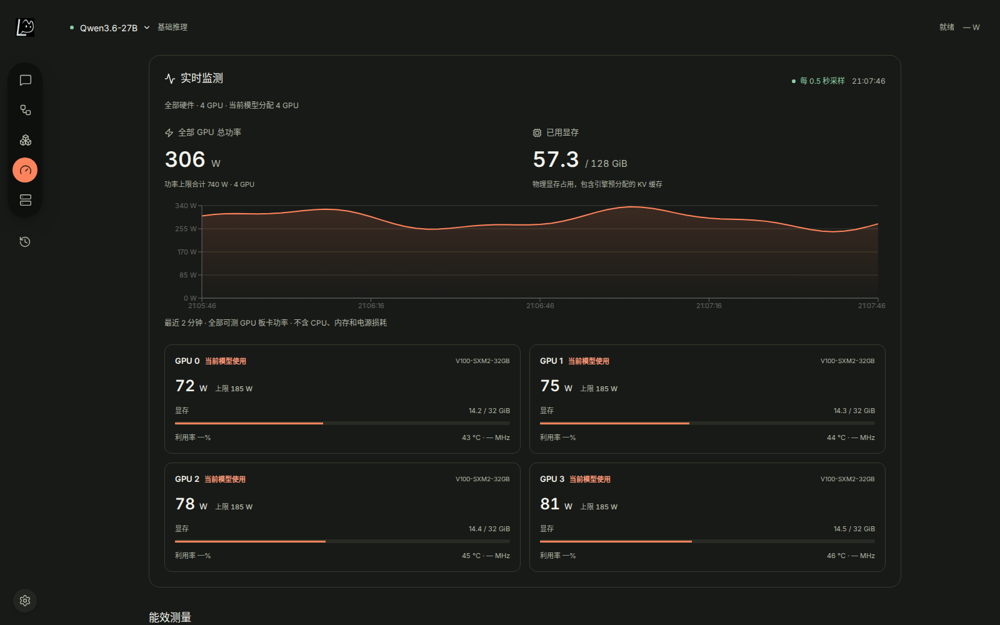

# 1Cat Studio

**把本地模型、代码任务与视觉创作，放进同一个工作台。**

1Cat Studio 是面向个人开发者、创作者和自托管团队的 AI 工作台。在自己的 Linux GPU 机器上部署，通过浏览器管理模型与推理环境，进行 AI 对话、执行代码任务、预览网页，以及生成图片和视频。

它把 **1Cat-vLLM 模型部署 → 对话与 Agent → 创作与交付 → GPU 监测** 连成一套日常工作流程。你可以从已有的模型和推理环境开始，也可以通过安装引导准备环境、下载适配模型，直接使用已有配置，也可以在高级设置中调整。

[为什么用它](#为什么用它) · [功能一览](#功能一览) · [界面预览](#界面预览) · [快速开始](#快速开始) · [文档](#文档) · [源码许可](#源码许可)



*聊天与网页预览：左侧讨论和修改，右侧直接查看可交互的页面。截图使用演示内容。*

## 为什么用它

### 从模型部署，到实际使用

导入模型、选择推理环境和 GPU、启动服务之后，就可以在同一个界面里聊天、使用 Agent，或把模型接入自己的应用。启动进度、日志、下载任务和失败重试都有对应入口，选择模型后即可使用；「调整」直接显示保存的参数，高级设置支持逐张选择 GPU、用滑块设置显存上限，并保存模型的默认配置。

### 面向自己的 GPU 机器

围绕 Linux、NVIDIA GPU 和 1Cat-vLLM 构建，包含 V100 / SM70 的环境安装、模型能力检查与多卡配置入口。可以按 GPU 选择模型用卡，设置张量并行、上下文和量化参数，并分别管理显卡功率策略。具体模型能否运行，取决于显存、权重格式和推理环境的支持情况。

### 对话里的想法，可以继续变成作品

聊天中生成的 HTML、CSS、JavaScript、SVG 和单文件 React 代码可以直接预览。需要修改真实项目时，切换到 Agent：读取项目文件、执行计划、修改代码、运行命令，并保留任务记录与文件改动。视觉创作则提供生成工作台和节点画布，支持把已有素材继续用于下一次创作。

### 保留现有环境，逐步接入

支持导入已有 Python / vLLM 环境、管理多个独立运行环境，以及接管兼容的现有服务。安装新环境后，由你选择在哪个启动预设中使用；应用、推理环境和模型权重分别管理。

### 看清资源消耗和等待时间

查看每张 GPU 的显存、功率与历史曲线，以及请求的首字延迟、输入输出 token、生成速率和耗电估算。界面区分 Prefill、Decode 与完整请求耗时，注明指标来源；缺失数据保持为空，便于判断瓶颈来自哪里。

使用本机模型时，聊天记录、项目文件和创作结果保存在部署机器上。首次准备环境和模型需要下载；如果配置外部创作服务，相应请求会发送到该服务。

## 功能一览

| 模块 | 可以做什么 |
| --- | --- |
| **模型与推理环境** | 按模型系列、发布者或完整仓库名查找模型；查看 ModelScope 模型卡、基础模型来源与模型许可；导入本地权重；从适配目录下载模型；安装或导入 1Cat-vLLM 环境；保存启动预设；选择 GPU、TP、精度、量化与上下文；查看启动日志、停止或切换模型。 |
| **AI 对话** | 流式回答、Markdown、代码高亮、表格与公式；编辑重发、重新生成、停止输出；系统提示词与采样设置；会话历史和 JSON 导入导出；在支持视觉的预设下进行图片问答。 |
| **代码预览** | 在对话旁运行 HTML / CSS / JS / SVG / 单文件 JSX、TSX；支持 React、Lucide、Recharts 等内置依赖；查看源码、错误信息、全屏与下载；代码在浏览器隔离环境中执行。 |
| **本地 Agent** | 基于官方 Codex 运行时连接本地模型；创建或导入项目；读取和修改文件、运行命令、展示执行计划与改动；继续或中止任务；支持计划、审查、项目指令和项目 skills。 |
| **图片与视频创作** | 原生 Z-Image 图片工作流、MiniMax-H3 视频工作流；选择模型、比例和分辨率；使用首尾帧或参考素材；查看任务阶段、预览和下载作品。需要相应原生创作环境与模型。 |
| **创作画布** | 把文字、图片、视频和音频放到画布上，通过连线组织参考素材与生成节点；保存画布、复用结果、查看任务历史；也可连接配置好的兼容图片或 H3 服务。 |
| **GPU 与能效** | 多卡状态、显存和功率曲线；选择受控 GPU、切换功率档位；在支持的硬件上进行能效校准，比较速度、首字延迟和请求能量。 |
| **API 与运维** | OpenAI 兼容的模型列表、聊天和文本补全接口；API Key 管理；后台任务与请求记录；配置和数据备份、恢复；管理器安装、升级与回退。 |

模型选择器和当前模型名称旁会标出发布者，例如 Unsloth、QUASAR-QAT；本地导入会另行标注。聊天与 Agent 的「思考」按钮会根据部署模型的模板显示可用强度：当前 Qwen3.8 模板支持关闭、低、中、极高，对应关闭思考及 `low` / `medium` / `xhigh`。选择会保存并用于后续请求；仅支持思考开关的模型仍显示开关。

界面支持中文 / English、浅色 / 深色主题与窄屏布局。图片理解、工具调用、推测解码及创作工作流会根据所选模型和运行环境开放，并非所有模型都支持全部能力。

## 界面预览

以下截图均由当前应用在浏览器中直接截取，使用独立演示数据，不包含真实用户会话或密钥。模型就绪状态、Agent 任务记录和 GPU 曲线用于展示界面，**不作为模型质量或性能实测结果**。截图来源见[说明](studio/docs/screenshots/README.md)。

### Agent：围绕项目完成任务

查看执行计划、对话和文件改动；右侧浏览项目文件，支持预览和导出。任务保留在项目中，后续可以继续完善。



### 模型：把常用配置保存成启动预设

集中选择运行环境、模型和 GPU，配置张量并行、精度、上下文与模型能力。能力开关依据检查结果开放，便于复用已经调好的配置。



### 画布：把创意、参考素材和生成步骤放在一起

将文字或媒体作为参考，连接到生成节点；后续可以把结果继续用于新的工作流。图中展示的是尚未提交生成的分镜草稿。



### GPU：看见每张卡的运行状态

查看整机与单卡的显存、功率和近期变化，再根据自己的速度与能耗需求配置硬件策略。下图同时展示深色主题。



## 快速开始

### 运行要求

| 项目 | 要求 |
| --- | --- |
| 部署平台 | Linux x86_64；通过现代浏览器访问。 |
| 从源码构建 | Python 3.12、Node.js 22.12+、npm、Git。 |
| 本地模型推理 | NVIDIA 驱动、与模型及硬件匹配的推理环境，以及足够的显存和磁盘空间。仅启动管理界面不会自动安装这些组件。 |
| Agent | 准备 Codex 组件和执行沙箱；使用已启用工具调用的本地模型。 |
| 原生图片 / 视频 | 包含对应原生创作模块的 1Cat-vLLM 环境、模型组件；视频 / 音频处理还需要 FFmpeg 和 FFprobe。 |

项目包含四张 V100 32 GB 的部署与创作验证记录，这不是所有功能的最低硬件要求。请按具体模型与工作流选择配置。

### 从源码启动

```bash
git clone https://github.com/1CatAI/1cat-studio.git
cd 1cat-studio

python3.12 -m venv .venv
.venv/bin/python -m pip install --require-hashes -r studio/requirements.lock

npm ci --prefix studio/frontend
npm run build:onecat --prefix studio/frontend

PYTHONPATH=studio/backend .venv/bin/python -m onecat --host 127.0.0.1 --port 8888
```

打开 **http://127.0.0.1:8888**，设置管理员密码，然后：

1. 在安装引导中安装推理环境，或导入已有环境。
2. 导入本地模型，或从适配目录下载模型。
3. 创建启动预设，选择模型、环境与 GPU，再启动服务。
4. 模型就绪后，进入聊天，或按需准备 Agent 和创作工作流。

批量克隆四张 V100（每张至少 16 GiB）的整块系统盘时，可在 Studio 的 user systemd 服务中用 `ExecStartPre` 运行 `python -m onecat.portable_gpu`，并为需要自动重绑的预设保存 `portable_gpu_binding: true`。每次启动会按显卡能力重新绑定本机 UUID，忽略显示用显卡；其他卡数或较小显存不会自动套用四卡预设。

默认数据目录为 `~/.local/share/onecat-studio`，可通过 `ONECAT_STUDIO_HOME` 环境变量或 `--state-dir` 参数修改。源码目录与数据目录分开保存。

日常调整界面时，可以在另一个终端运行：

```bash
npm run watch:onecat --prefix studio/frontend
```

修改前端源码后会自动重新构建，等待终端显示构建完成，再刷新 Studio 页面即可看到变化，无需重新打包或重启模型。修改 Python 后端后，重启 Studio 管理进程以加载新代码；保持相同的数据目录。前端类型检查单独运行 `npm run typecheck:onecat --prefix studio/frontend`。修改代码预览运行时或许可证文件后，重新启动构建监听。

如果 Studio 运行在服务器上，先建立 SSH 转发，再打开本机浏览器。将下例的端口、用户名和地址替换为实际值：

```bash
ssh -L 8888:127.0.0.1:8888 -p 22 user@your-server
```

### 启用 Agent

在仓库根目录准备固定版本的 Codex 组件：

```bash
.venv/bin/python studio/scripts/prepare-agent.py
```

Agent 还需要可用的 bubblewrap 沙箱。若页面提示沙箱未就绪，由服务器管理员配置：

```bash
sudo bash studio/scripts/install-agent-sandbox.sh
```

随后在模型启动预设中启用受支持的工具调用能力，启动模型并进入 Agent 页面创建项目。执行限制、项目导入与命令说明见 [Agent 文档](studio/AGENT.md)。

### 接入自己的应用

在「服务」页创建 API Key，可使用以下 OpenAI 兼容接口：

```text
GET  /v1/models
POST /v1/chat/completions
POST /v1/completions
```

例如，使用服务页中的模型名称发起请求。下面的 `onecat-model` 是默认服务模型名；`ONECAT_API_KEY` 请在自己的环境中设置。

```bash
curl http://127.0.0.1:8888/v1/chat/completions \
  -H "Authorization: Bearer ${ONECAT_API_KEY}" \
  -H "Content-Type: application/json" \
  -d '{
    "model": "onecat-model",
    "messages": [{"role": "user", "content": "你好，介绍一下你能做什么。"}],
    "stream": true
  }'
```

## 当前能力边界

- **Studio 管理工作流，推理能力由环境和模型提供。** 不包含模型权重，不保证任意量化或检查点均可运行；模型目录中的适配条件与页面检查结果是配置依据。
- **Agent 使用本地模型与项目沙箱。** 支持计划、工具执行和文件操作；暂未接入 Codex 云任务、外部 Apps / MCP、多 Agent 编排或任意联网执行。任务效果取决于本地模型能力。
- **代码预览面向独立页面和单文件组件。** 尚不支持任意 npm 依赖安装、多文件构建服务器或完整开发容器。
- **原生创作需要对应环境。** 常规文本推理环境不等于创作环境；例如 1.5.0 wheel 不包含 H3 原生模块。部分工作流与加速路径带有实验性标记，具体条件见[创作工作台文档](studio/CREATIVE-WORKBENCH.md)。
- 当前重点是单机自托管，不包含训练 / 微调、内置 RAG 知识库、跨节点集群调度或 Windows 安装器。

## 文档

| 想了解什么 | 文档 |
| --- | --- |
| 安装、服务管理、环境导入、备份和恢复 | [运行手册](studio/OPERATIONS.md) |
| Agent 项目、命令、执行权限与沙箱 | [Agent](studio/AGENT.md) |
| 原生图片 / 视频生成、模型准备与已有验证 | [创作工作台](studio/CREATIVE-WORKBENCH.md) |
| 画布、参考素材、服务接入与工作流 | [创作画布](studio/CREATIVE.md) |
| 模型加载、切换和资源协调 | [模型生命周期](studio/MODEL_LIFECYCLE.md) |
| 独立实现的检查范围与验证结果 | [实现验证](studio/docs/independent-source-validation.md) |
| 源码来源及第三方组件许可 | [源码边界](SOURCE_ORIGIN.md) · [第三方声明](studio/NOTICE.md) |

### 开发与打包

在完成上述依赖安装后，可运行现有检查：

```bash
.venv/bin/python -m pip install pytest pytest-asyncio
ONECAT_AUTO_GPU_ACTIONS=0 CUDA_VISIBLE_DEVICES= \
  .venv/bin/python -m pytest -q studio/backend/onecat_tests
npm test --prefix studio/frontend
python3 studio/scripts/check-source.py
```

离线安装包由 `.venv/bin/python studio/scripts/package.py` 构建，需要 `uv`。安装包包含应用、对应源码归档与第三方声明；推理环境和模型权重独立准备。浏览器验收脚本位于 `studio/scripts/`，需要额外安装 Playwright / Chromium。

遇到问题或希望改进功能，可以在 [Issues](https://github.com/1CatAI/1cat-studio/issues) 中说明使用场景，并附上 Studio / 推理环境版本、GPU、模型及相关日志。请先移除密钥和私人数据。

## 源码许可

当前应用源码采用 [1Cat Studio Community Source License 1.0](LICENSE)。

| 使用方式 | 当前许可 |
| --- | --- |
| 个人使用、学习、修改 | 允许 |
| 企业内部部署与使用 | 允许 |
| 符合许可证条件的再分发 | 允许，需保留许可证及相关声明 |
| 销售预装软件或包含软件镜像的硬件、软硬件捆绑销售 | 需要另行取得书面授权 |
| 换皮、改名或包装后作为自有软件产品销售 | 需要另行取得书面授权 |

这是对特定销售行为作出限制的**源码可用许可**，不属于 OSI 定义的开源许可。完整条款以 [LICENSE](LICENSE) 为准；第三方组件和模型继续适用各自许可证，历史版本已经授予的许可权利不受影响。
